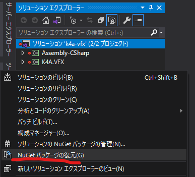

# k4a-vfx

[](https://github.com/microsoft/Azure-Kinect-Sensor-SDK)


## About

Azure Kinectの点群をUnity Visual Effect Graphで使うサンプルプロジェクト。  
表現の幅を考えてHDRPを採用しています。動作にはGPUを積んだWindwosデスクトップPCが推奨です。

## Tested Environment

||環境|
|:---|:---|
|OS|Windows 10 Home|
|Unity|2019.4.16|
|Render Pipeline|HDRP 7.3.1|
|Azure Kinect Sensor SDK|1.4.1|
|GPU|NVIDIA GeForce GTX 1060 3GB|

## Dependency

以下のNuGetパッケージに含まれるDLLを使用しています。
プロジェクトを実行する際にセットアップが必要になります(後述)。

|package|version|
|:--|:--|
|Microsoft.Azure.Kinect.Sensor|1.4.1|
|System.Memory|4.5.3|
|System.Numerics.Vector|4.5.0|
|System.Runtime.CompilerServices.Unsafe|4.6.0|
|System.Buffers|4.5.1|

UPM(Unity Package Manafger)経由で以下のパッケージをインポートしています。

|Package|version|
|:--|:--|
|Unity Recorder|2.5.2|
|UniTask|2.0.73|

## Setup & Usage

プロジェクトのセットアップには以下の二通りの方法があります。
Unityで開く前にどちらかの方法でセットアップを済ませておくと効率的だと思います。

### Using Visual Studio

リポジトリを適当なディレクトリへclone後、ソリューションファイル(`k4a-vfx.sln`)VisualStudioで開きます。
ソリューションファイルが見つからない場合は、Unityでプロジェクトを開いてから、メニューバーのAssets->Open C# ProjectからVisual Studioを開きます。
そしたらソリューションウィンドウのソリューションを右クリックして「nugetパッケージを復元」を選択し、Visual Studioを閉じます。



最後に`movePackages.bat`を実行し、Unityプロジェクトを開きます。

### Using NuGet CLI

プロジェクトのルートディレクトリで以下のコマンドを実行します。

```bash
# install nuget packages
$ nuget install packages.config -o ./External/Packages

# copy dlls from nuget packages
$ ./movePackages.bat
```

そのあとにUnityプロジェクトを開きます。

## Contact

何かございましたら、[にー兄さん](https://twitter.com/ninisan_drumath)までご連絡ください。
